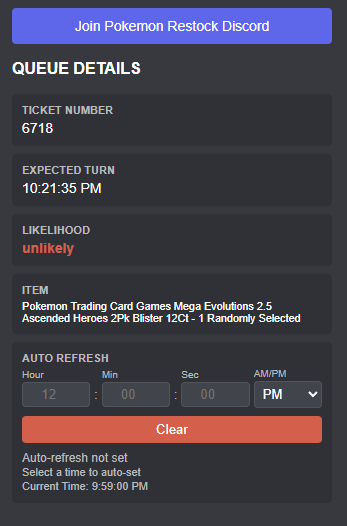

# Walmart Queue Decoder

A Chrome extension designed to decode Walmart Queue-it data directly from the URL, providing insights into your position and likelihood of access.

## Features

- **Decodes Queue Parameters**: Extracts ticket number, expected turn time, and admission likelihood.
- **Auto-Refresh**: Set a specific time for the page to automatically refresh, ensuring you're ready for the drop.
- **Discord Theme**: Sleek dark interface matching Discord's aesthetic.
- **Quick Links**: Direct access to the Pokemon Notify Discord community.

## Installation

To install this extension in Google Chrome:

1.  **Download and Prepare the Files**:
    *   **Option A (Git)**: Clone the repository using `git clone`.
    *   **Option B (ZIP)**: Click the green **Code** button and select **Download ZIP**. Once downloaded, **extract/unzip the file** to a folder on your computer.
        > **Note**: You cannot verify the extension directly from the `.zip` file. You *must* extract it to a folder first.
2.  Open Chrome and navigate to `chrome://extensions/`.
3.  Enable **Developer mode** by toggling the switch in the top-right corner.
4.  Click the **Load unpacked** button.
5.  Select the folder where you extracted the files (this folder should contain the `manifest.json` file).
6.  The extension should now appear in your list and be ready to use!

## Updating the Extension

Since this extension is manually installed, follow these steps to update it:

### Option A: Git Users
1.  Open your terminal in the project folder.
2.  Run `git pull` to fetch the latest changes.
3.  Go to `chrome://extensions/` in your browser.
4.  Find the **Walmart Queue Decoder** card.
5.  Click the small **Reload** icon (circular arrow) in the bottom right of the card.

### Option B: ZIP Users
1.  Download the latest ZIP file from the repository.
2.  Extract the contents into the *same folder* where you previously installed the extension (overwrite the existing files).
3.  Go to `chrome://extensions/` in your browser.
4.  Find the **Walmart Queue Decoder** card.
5.  Click the small **Reload** icon (circular arrow) in the bottom right of the card.

## Usage

1.  Navigate to a Walmart Queue page during a drop.
2.  Click the **Walmart Queue Decoder** icon in your browser toolbar.
3.  The popup will display:
    -   **Ticket Number**: Your queue position.
    -   **Expected Turn**: Estimated time of entry.
    -   **Likelihood**: Probability of gaining access.
    -   **Item**: The product you are queuing for.
    -   **Auto-Refresh**: Use the inputs to set a time for the page to refresh automatically.

## FAQ

**Q: Does the auto-refresh reload the whole browser?**
**A:** Yes. The timer syncs across all open tabs and windows using Chrome's storage. When the time arrives, *all* tabs with the extension active will reload simultaneously. This uses the browser's shared storage to ensure every instance is ready.

**Q: Should I use a proxy for multiple windows?**
**A:** Yes. If you are running multiple instances (especially with the same IP), Walmart may flag your traffic. Using proxies for separate windows/profiles is recommended to avoid IP bans. I recommend [BP Proxy Switcher](https://chromewebstore.google.com/detail/bp-proxy-switcher/bapeomcobggcdleohggighcjbeeglhbn?hl=en) for easy proxy management.

## Community

Created by IvanRamii! Join the [Pokemon Restock Discord](https://discord.com/invite/7n4VEx9jaU) for accurate restock alerts and community support!
