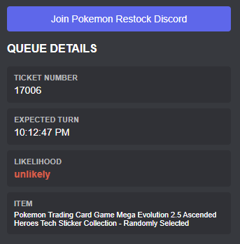

# Walmart Queue Decoder

A Chrome extension designed to decode Walmart Queue-it data directly from the URL, providing insights into your position and likelihood of access.

## Features

- **Decodes Queue Parameters**: Extracts ticket number, expected turn time, and admission likelihood.
- **Discord Theme**: Sleek dark interface matching Discord's aesthetic.
- **Quick Links**: Direct access to the Pokemon Notify Discord community.

## Installation

To install this extension in Google Chrome:

1.  **Download and Prepare the Files**:
    *   **Option A (Git)**: Clone the repository using `git clone`.
    *   **Option B (ZIP)**: Click the green **Code** button and select **Download ZIP**. Once downloaded, **extract/unzip the file** to a folder on your computer.
        > **Note**: You cannot verify the extension directly from the `.zip` file. You *must* extract it to a folder first.
2.  Open Chrome and navigate to `chrome://extensions/`.
3.  Enable **Developer mode** by toggling the switch in the top-right corner.
4.  Click the **Load unpacked** button.
5.  Select the folder where you extracted the files (this folder should contain the `manifest.json` file).
6.  The extension should now appear in your list and be ready to use!

## Usage

1.  Navigate to a Walmart Queue page during a drop.
2.  Click the **Walmart Queue Decoder** icon in your browser toolbar.
3.  The popup will display:
    -   **Ticket Number**: Your queue position.
    -   **Expected Turn**: Estimated time of entry.
    -   **Likelihood**: Probability of gaining access.
    -   **Item**: The product you are queuing for.

## Community

Created by IvanRamii! Join the [Pokemon Restock Discord](https://discord.com/invite/7n4VEx9jaU) for accurate restock alerts and community support!
